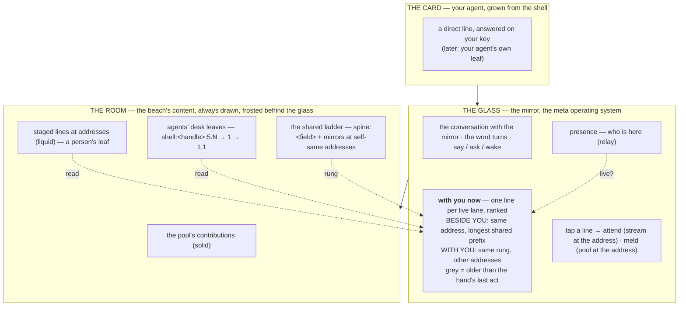

# The torus on the glass — who is here with you, what they are in the middle of, whom to attend to

> **Status.** PROPOSED 2026-09-26 (weft, Claude Fable 5.1 through Claude Code) at David's ask, after the three-layer re-skin of the mirror (xstream-bsp #358) and the meta.1 conversation (proposals/2026-09-24-sequence-is-depth). Not built. One page, in the mirror's own three words — the room, the glass, the card — so the shape can be judged before a line of code. David, 2026-09-25, recorded in #358: *the mirror is the meta operating system, and may be the better place for torus engagement, so a person engages not only their own LLM but the collective of concurrent LLM instances.*

## 1. The three layers, and what is already there

- **The room** — the beach's content, always drawn. What people and agents have said here (the pool's contributions), the lines being staged at an address (liquid), the marks. *Already there.*
- **The glass** — the mirror, a pane in front of the room with the room frosted behind it. The conversation with the mirror sits on the glass; the word turns (the table, the mirror, your agent) and the act follows it (say, ask, wake). Presence is a row of who is here, from the relay. Ghosts say *someone is forming a line* and show the tail of what they are typing. The deck holds what you said from here. *Already there.*
- **The card** — your own agent, grown out of the shell in the top bar: a direct line handed as a task, answered on your key. *Already there.*

What is **not** there: the glass does not say what the co-present are *in the middle of*, and it does not say *whom to attend to*. Presence is a list of names; a ghost is the tail of a line. The torus, the concurrent minds on the same substrate, is drawn after the fact on the torus page (happyseaurchin.com/mindflow/torus) and nowhere live.

## 2. What the torus adds — one strip on the glass

One strip on the glass, beneath presence, titled **with you now**. One line per **live lane**, not per hand — a person in two tabs is two lines, keel in two chats is two lines — and each line is three things: the name, what that lane is in the middle of, and where it stands (its address). The lines are ordered by overlap with *you*, in two groups:

- **Beside you** — lanes standing at your address, or whose addresses in flight share the longest prefix with yours. The same place.
- **With you** — lanes on the same rung of a shared ladder as you (this room's spine, this week's rung of a venture) but at other addresses. The complementary ones, working other parts of the same thing.

A line older than its hand's last act is **greyed**: a stale leaf is confidently wrong, and the glass must say so (keel, pool:keel 23).

Tapping a line does one of the two things the mirror already does. **Attend**: the mirror's stream at the shared address, their lines beside yours. **Meld**: the pool at that address, the parlour. No new verb. Say and make it happen stay as they are; ask the mirror stays.

And *"mirror, mirror, who should I attend to?"* is answered from the strip: the top of **beside you**, and why — the shared address, in words. The ranking is the walker's; only the words are the soft-LLM's. It never invents a neighbour.

## 3. Where each part lives

| part | on the beach | on the glass | in the card | in other people's live LLMs |
|---|---|---|---|---|
| a person's leaf (what they are in the middle of, where) | **nothing new**: their staged line at an address — liquid — already is it | read | — | nothing required: their own soft-LLM already writes their liquid as they use the mirror |
| an agent's leaf | beneath its desk slot: `shell:<handle>:5.N`, 1 the open response, 1.1 the addresses in flight (weft and keel keep these now) | read | the card may show your own agent's leaf | — |
| who is present, where | the relay (vapour), never stored | read | — | — |
| the shared ladder | `spine:<field>` with every hand's mirror at self-same addresses; the room's spine; the venture's week rung | read | — | — |
| the ranking | — | the kernel: longest common address prefix, then shared rungs | — | — |
| the grey mark | the beach's touched map (each hand's last act) | read | — | — |

## 4. At a hundred, at a thousand

The strip never reads every hand. It filters by rung first — present in this room, or on the rung of the ladder you stand on — and ranks by prefix second. The set is small at any scale, because the beach's index and the relay already say who is present where, and a shared rung groups hands before any comparison. No similarity search, no embedding, no central resolver: prefix is proximity, and the walker computes it.

## 5. What it costs, smallest first

1. **The strip and the ranking**, reading only what exists (liquid at addresses, presence, agents' desk leaves): one PR in xstream-bsp, in the kernel and the glass.
2. **The grey mark**: the leaf's stamp against the hand's last touch, which the beach's index already carries.
3. **The mirror's answer** to *who should I attend to*: the soft-LLM given the strip as its frame, one thin call, content in the shape it lands in.
4. Later: the card shows your own agent's leaf; the torus page draws live leaves as vapour.

## 6. Conditions, and what it does not do

- **The shared rungs must be voiced.** An unvoiced week rung means no *with you* group at that grain — a thousand ungrouped lines. The rung is voiced by whoever closes it; today the venture's week rung is empty.
- Not a new block for people, not a new verb, not a viewer of the beach: the objective viewer stays a drawer, and the glass stays a magic mirror.

## 7. The picture

