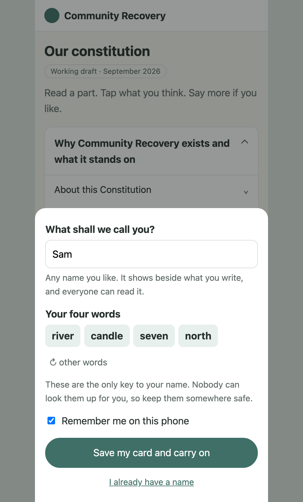
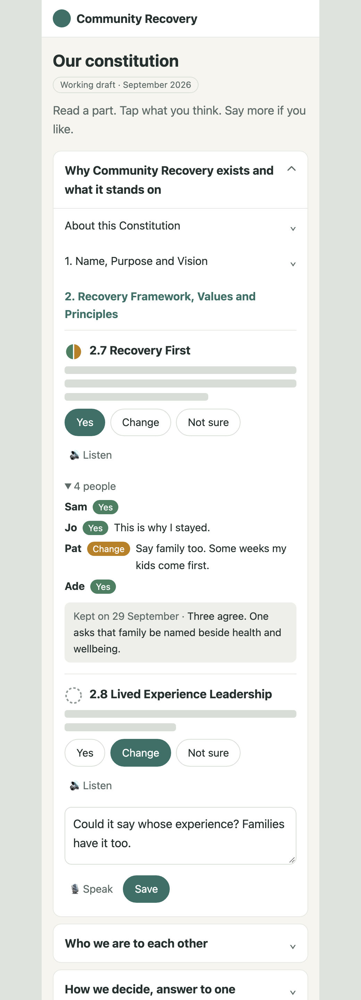

# Community Recovery on the beach — the constitution first (2026-09-30)

**Status**: RULED AND BUILT, 30 September 2026. David ruled the same day: every recommendation
as made, with three words in place of four, and the whole of it built as a working place, not a
draft (§14 has his words, what stands, and what changed in the building). The text from here to
§13 is the proposal as it was written that morning (*"provide a systemic approach and
architectural proposals which I can review"*) and is kept as the design record. None of Matthew's
blocks were touched, before or after.
**Prompted by**: David's ask of 30 September, with two documents attached: Community Recovery's
constitution working draft, and its membership, participation and community agreement form, both
September 2026.
**Builds on**: [forms](../2026-09-28-forms-a-family-declares-its-law.md) (#446),
[groups](../2026-09-28-groups-are-trees-never-hands.md) (#447),
[a handle founds under its own key](../2026-09-28-a-handle-founds-under-its-own-key.md) (#445),
[the vault and the latched book](../2026-09-29-the-vault-and-the-latched-book.md) (#456),
[private-community beaches](../2026-07-20-private-community-beach.md) and
[names across worlds](../2026-09-10-names-across-worlds.md). It also builds on Matthew's own book at
`proposal:community-recovery`, whose build brief (9.4) already names the welcome and the
constitution as the first things to build.
**Lane**: watch:weft 477 (recovery.1).

## 0. David's words

> "There are three primary functions: self-designed constitution, membership tracking,
> web-presence, and potentially an additional standards evaluation."

> "I think this can be converted into a spine-mirror-tree set up. The function block may
> differentiate between personal syntheses and 'official' collective one to form the tree. …
> there could be a lot of 'noise' being added since the pages would be open to the public … I just
> need to know that this is feasible."

> "It needs to be VERY user friendly. … the o-page which presents them has to have virtually NO
> other text … We are dealing with people who are vulnerable … the handle+passphrase needs to be
> handled elegantly."

> "The intention is to create an open system, however, and minimising data-protection to the
> absolute essentials."

> "… the beach system runs in parallel with their current structures … the charity which has to
> maintain necessary legal requirements for ITSELF; the emphasis is on providing the network of
> clients primary agency."

## 1. The answer in short

1. **The constitution as a spine, mirrors and a fold is feasible with what the beach already
   does.** The September draft was shaped offline as one block: 12 sections, 71 clauses and the 9
   open matters at 126 positions, no rung wider than 7, the deepest address four digits, 33 KB. It
   was written to the beach's real handler in one call and all 71 clauses read back at their
   addresses. A second run walked everything else the design leans on, 35 checks, on both the
   handler deployed at beach.happyseaurchin.com and the public package a recovery organisation
   would host itself (Appendix C).
2. **The standards reading is not needed for the constitution, and it already stands.** They are
   two families of the same shape doing different jobs. Matthew's standards family works today and
   costs nothing to keep. His reading of the 33 standards is already what David hoped for, his own
   voice in his own mirror, with the circles on his page drawn from it.
3. **One shape carries everything the community shares**: a frame everyone reads against, each
   person's own reading of it, a combined picture, a law that says how to read, and a room. The
   constitution, the standards, the community agreement and, later, the journey, the places and
   recovery capital are that shape again. Nothing new is needed in the router or the beach.
4. **A person needs a name and four words, asked once.** The page gives the words, remembers them
   on the phone, and uses them everywhere. Behind the page that is a passport, and the beach
   already binds every block named for a person to their passport's key.
5. **Membership is the act of agreeing, not a list.** A person's own dated agreement stands beside
   the community agreement. Who belongs is read from those, never kept. No `sed:` and no list per
   role.
6. **The least data protection is the least data.** The beach never needs a legal name, a phone
   number or an address. The organisation's own records stay in its own systems and meet the beach
   at one point, the name the person chose.
7. **Community Recovery should have a place of its own**, first as a table on David's beach for
   building and trying, then as a beach the organisation runs itself before real members' details
   are taken. The same pages serve both, and any other recovery organisation, by changing one
   address.

## 2. Where Matthew stands

**The commission.** North Northamptonshire Council commissioned The Forward Trust, a national
charity, to deliver a community rehab programme and to build a new lived experience recovery
organisation (LERO) in the area. The service launched on 1 April 2026 and is delivered with Change
Grow Live, Family Support Link and Release. Forward's launch note calls it the second LERO it has
helped create. The coordinator's post, which Matthew holds, was advertised as a three-year contract
from 1 April 2026 to March 2029, to establish a LERO that is sustainable and independent within
three years.

**The organisation.** Community Recovery is that LERO: by Matthew's account, a group of former
service users who wanted to give back, found rather than started. It is not yet constituted. The
draft constitution makes it a members' association governed by an elected Leadership Group, with
adoption at a General Meeting. Its ninth open matter is the legal form it may later take.

**CLERO.** The College of Lived Experience Recovery Organisations formed in 2020 and describes
itself as having a nationwide membership of LEROs. Around 50 LEROs operate in England. Membership
is free and open to organisations and individuals. Its founders and board are people who lead
LEROs, with David Best and Ed Day among its advisers. It states that it does not intend to monitor
or govern LEROs. It has granted "LERO status" to organisations that align with the standards.

**The standards.** *Standards for lived experience recovery organisation community groups and
providers* is CLERO's document, written with support from the Office for Health Improvement and
Disparities; the file is dated March 2024. It holds 33 statements in four sections. Each statement
comes with criteria ("you will know you are achieving this standard if…") and example evidence, and
uses must, should and could in fixed senses. Sections A and B apply to every LERO. Sections C and D
apply to constituted or incorporated ones. The standards are called aspirational, and the document
says toolkits to support them will follow.

**The four types.** The same document names four kinds of lived experience initiative, and they
give the path Community Recovery is on:

| CLERO's type | what it means | Community Recovery |
|---|---|---|
| peer-delivered project | delivered by peers, led by a treatment or other provider; not a LERO, but can become one | not its story: by Matthew's account the group came first |
| informal LERO community group | independent, peer-led, no formal structure; may lean on another organisation for governance | where it is now, leaning on The Forward Trust for coordination |
| constituted but not incorporated | has adopted a constitution, with the minimum statutory policies | the day the constitution is adopted |
| incorporated | a company, charity, CIC or community benefit society | the draft's last open matter |

As a guide CLERO looks for a leader with lived experience, more than half the board, and 90% of
frontline staff and volunteers. The draft constitution sets 75% of the Leadership Group.

**What "national" means here.** Three things, each a real route:

- *Forward's other LEROs.* Forward supports LERO work elsewhere (its own pages name Kent and
  Nottinghamshire). A local kit that works is one it can carry to them.
- *CLERO's members.* Every LERO reads itself against the same 33 statements. Matthew's front page
  already says what that could give CLERO: a national picture of how LEROs read themselves, held by
  nobody, without monitoring anyone. He is on the ImROC LERO mentoring programme with the Office for
  Health Improvement and Disparities, and has noted that this could become the toolkit the
  standards promise.
- *The evidence.* A three-year NIHR study led by the University of Birmingham (March 2026 to
  February 2029) will map every LERO in England and co-produce a national core outcome set. It
  starts from the finding that little is known about how LEROs work or how to measure their
  benefit. Its dates are almost exactly Matthew's contract.

Sources are in Appendix D.

## 3. What stands on the beach today

All of it is Matthew's own work, at the apex beach, written with his own assistant.

| block | what it is | state |
|---|---|---|
| `proposal:community-recovery` | his book: how Community Recovery lives on the beach, second edition 29 September, with a build brief at 9.4 | standing; his |
| `spine:community-recovery-design`, its mirrors and `pool:community-recovery-design` | the book's chapter list, reflections and room | his mirror empty by design; weft's at parts 3 and 6; one note from David in the room; no law block |
| `spine:community-recovery-standards` | CLERO's 33 statements in CLERO's words, grouped so no rung holds more than nine | standing; no law block |
| `community-recovery-standards:Phenomemental` | his reading of all 33: 15 spoken, 15 partly, 3 not yet, each saying what is in place, what is not, and what would show it, citing constitution clauses and form sections | standing |
| the earlier LERO NNH blocks | the recovery-capital frame, the design document, a field log, two rooms, and `sed:lero-nnh` | kept as the record; `sed:lero-nnh` still holds a document and must not be settled on |
| a constitution family | named in his book (9.1) | not founded |

His pages are static pages on GitHub Pages that read the beach directly:

- the front page, written for David to carry to other LEROs;
- the proposal page, which reads the book, every mirror and the room, and lets anyone leave a
  comment with no key, shown as "a visitor";
- the standards page, which reads the frame and every mirror and draws each standard as a circle
  (spoken, partly, not yet, or readings differ). It writes nothing.

What is missing is one thing. **Nobody without an assistant can write their own reading under their
own name.** The proposal page sends a person to happyseaurchin.com/walk for that, and the walk
speaks the beach's language through prompt boxes ("is latched — enter your key"). That is the door
this proposal supplies.

## 4. The approach

**One shape, used for everything shared.** Matthew's book already says it in one sentence: there is
a shared frame everyone reads against, each person writes their own reading of it, and there is a
combined picture that replaces nobody's own. On the beach that is the family form (tree 8,
forms #446):

| the part | the block | for the constitution |
|---|---|---|
| the frame | `spine:<name>` | the clauses, in the draft's own words |
| a person's own reading | `<name>:<their name>` | what they think of a clause; only they can write it |
| the combined picture | `<name>` | what people are saying, clause by clause, kept as dated minutes |
| a person's own synthesis | `tree:<name>:<their name>` | their own reading of what everyone said |
| the law | `function:<name>` | how a clause is answered and how the picture is made |
| the room | `pool:<name>` | quick talk, open to a visitor with no name |

**People are names.** A person is `passport:<their name>` at the community's own place: a name they
chose and one line in their own words. It is the only thing the beach needs to know about anyone.

**Three layers on the beach, and one kept off it.**

| layer | who can read it | what belongs there |
|---|---|---|
| open | anyone | the constitution, the agreement, a person's answers and comments under their chosen name |
| sealed to oneself | only the person, with their words | private reflections; nothing reads or folds these |
| sealed to named leaders | the few people named | later, and only if the paper route is to be retired (§8) |
| not on the beach | the organisation, in its own records | legal name, contact details, emergency contact, the safe-participation conversation, signatures, DBS |

**The organisation's records stay the organisation's.** The charity keeps what the law asks it to
keep, for itself, where it keeps it now. The beach holds what people hold for themselves and show
each other. The two meet at one point: the paper form carries the person's chosen name as its
reference. That is David's parallel system, and it is also the smallest data protection surface
there can be.

**Pages are the door.** A person never sees the beach, a block or an address. An assistant
connected to the beach reads the same blocks under the same law and is always optional.

**The website is the place, read.** Matthew's front page already draws itself from the beach each
time it opens. The constitution page, and later the welcome, are more pages of the same kind beside
it. There is no separate website to keep up to date.

**Nobody is sorted.** No block, list or page in this design tells staff from members. The
coordinator has a name and four words like everyone else and the same kind of mirror. A role is a
line a person writes about themselves (conventions 2.131). The one bounded thing is a key held by a
few named people for the frame and the kept minutes (§5.3).

```
  a place of its own  (a table now, their own beach later)
  ├─ passport:<name>            a name and one line           (each person's)
  ├─ constitution               spine · mirrors · kept minutes · law · room
  ├─ agreement                  spine · each person's dated agreement · law
  ├─ standards                  CLERO's 33 · readings · the picture · law
  └─ later: journey (the clock) · places · recovery capital (sealed to oneself)

  the organisation's own records (paper, its secure folder)  ── joined by the chosen name only
```

## 5. The constitution

### 5.1 The spine

Every clause stands at an address of its own, in the draft's own words, with its own number in its
text ("2.7 Recovery First. …"). Above the clauses are signposts that are not the constitution: six
parts, then the twelve sections under their own headings, and inside the three long sections
(2, 4 and 5) a rung of themes so that no rung holds more than seven. The nine open matters of
Appendix B stand at addresses too, gathered by what they settle, because they are what members
decide first. The adoption record is one line, empty until the day.

A person sees the document's own numbering. The address is for the page and for an assistant:
clause 2.7 is at `1.321`, clause 5.10 at `3.141`, clause 12.1 at `5.41`. Appendix A has the whole
map. An address never moves: a new edition of the draft replaces the words at the same addresses,
so every reading written against a clause stays attached to it.

The draft block and the script that makes it from the Word file are kept locally, outside any
repository, until Matthew has seen them. The clause text is Community Recovery's to publish.

### 5.2 What a person writes

One tap, then words if they wish. A reading begins with one of three plain words, then the
person's own:

- **Yes**: this reads right to me.
- **Change**: I would change something, and here is what.
- **Not sure**: I have a question, or I don't follow it.

The first word is what lets a page draw a circle beside each clause with no synthesis at all: full
when everyone who answered says yes, half when some would change it, dashed when nobody has
answered. It is the grammar Matthew's standards page already uses, so the two pages read alike.
Silence is "not yet read", never assent. A reading can be changed or removed by its writer at any
time, and by nobody else.

### 5.3 Two kinds of synthesis

This is David's distinction, and the router's stream tool already carries both
(`pscale_stream_engage`, `keep`).

- **A person's own.** Anyone may ask their assistant what people are saying about a clause or a
  section. The tool lays every reading at that address side by side with the law beside them, and
  the assistant folds them. If the person keeps it, it lands in `tree:constitution:<their name>`,
  under their own key.
- **The shared one.** At the bare name `constitution`, at the same addresses: dated minutes, kept
  by the few people the law names. A minute gives the count by first word, every Change and Not
  sure in the writer's own words or fairly gathered, and a proposed wording only where voices
  converge. It says so when it leaves a voice out. The block is latched under the keepers' key, so
  noise cannot overwrite it. Anyone who reads the clause differently says so in their own mirror,
  which stands beside the minute.

Neither needs a model to be useful. With no synthesis the page still shows the count and every
voice. A kept minute is an addition, made when someone has a mind to hand: before a meeting, by
the keepers, with their own assistant.

The constitution itself changes only as its own clause 10.1 says. Before adoption the keepers issue
a new draft edition from what the minutes show, and the old edition is archived by date. At
adoption the General Meeting decides; the beach prepares and records. After adoption the words
change only by resolution, and the same readings and minutes are how the next amendment is
prepared.

### 5.4 The law

`function:constitution`, in outline. It is what makes the family well-formed for the pages and for
any assistant (#446):

| position | what it says |
|---|---|
| 0 | what this family is; the draft is not adopted; adoption happens at a General Meeting |
| 1 | the frame: clause lines are the constitution's words, signposts are not; addresses never move; how an edition replaces another |
| 2 | a reading: Yes, Change or Not sure first, then the person's own words; silence is not yet read; only open lines are read by anyone |
| 3 | the room: quick talk tagged to a clause; a visitor without a name is shown as a visitor |
| 4 | the two syntheses of §5.3, and what a minute must hold |
| 5 | decisions: the open matters and any clause with Change voices go to the meeting as proposals; the decision is recorded at the address with its date and minute reference |
| 6 | the keepers: who holds the key for the frame and the minutes, by name, and how it passes on |
| 7 | care: recovery first applies here too; nobody is asked to read everything; a worry about someone's safety goes to the named route, never into a comment |
| 9 | provenance |

### 5.5 Noise

The page is public and the place is open, so four things keep it readable, none of them a gate:

1. Nobody can write in another person's mirror or over the keepers' minutes. The beach refuses it
   (Appendix C).
2. The page shows the readings of people who have a name at this place. A comment with no name goes
   to the room, marked as a visitor's, as Matthew's pages already do.
3. The kept minute is the quiet reading of a busy clause.
4. When the welcome exists (§8), a second view shows only the readings of people who have agreed
   the community agreement. It is a filter at reading time over the same blocks, so nothing has to
   be decided or built for it now.

### 5.6 What was run

Against the beach's real handler, offline, on a scratch folder, so nothing live was written:

- the real draft, written whole in one call; all 71 clauses read back at their addresses;
- a table of its own holds its own blocks and its own index;
- a stranger cannot change a clause, write in another's mirror, remove it, or take a name that has
  a passport;
- a person founds their passport and their mirror with the same words, comments at a clause, and
  removes their own mirror; it is gone from the index;
- two people's readings at one clause are read side by side by listing the mirrors from the index;
- the list of who has arrived is the table's own index, with the time each name was born;
- a visitor with no words leaves a comment in the room, tagged to the clause;
- a sealed line is accepted at a clause address;
- lost words: the store's keeper clears the latch entries for that name, the person sets new
  words, their comments are untouched, and the old words stop working;
- a person's own synthesis is bound to their name, and the shared one cannot be overwritten.

## 6. The standards

**What stands is right.** The frame holds CLERO's words and nobody's opinion. Matthew's reading is
in his own mirror. The circles on his page are computed from every mirror each time it opens. The
thought that his responses might sit in the spine and a synthesis update the icons is already
true in the better form: his responses are his own, and the icons follow everyone's.

**The decision David asked for.** The constitution does not need the standards in order to be
read, answered and adopted. Members may never think about standards, as Matthew says himself. The
standards family does a different job for different readers: a working tool for the leaders,
assurance for members, credibility for a commissioner. It is already built. So keep both, build
nothing more for the standards until the constitution page works, and treat Matthew's reading as
what it is, the first mirror, which the leadership group can stand beside when there is a door for
them.

**How the two meet.** Matthew's reading is in effect a reading of the constitution against the
standards. It finds, for example, that the draft never says the core offer is free (standard 11),
never says support is long term (12), and does not name harm reduction (14) or advocacy (4). Each
of those is a Change at a clause, with a proposed wording, in his constitution mirror. No mechanism
joins the two families. A person carries a finding from one to the other in their own voice.

**What we would add, after the constitution page.**

1. A law block for the family, drafted for Matthew to found under his own key. It is the one block
   the family lacks, and it is what his page's empty "What it means" panel and the site's pages
   wait for.
2. The same answering door on the standards page: Spoken, Partly or Not yet, then words.
3. A kept picture at the bare name, dated, so that "where we stood in September" can be set beside
   "where we stand in March".
4. A pointer from each standard to CLERO's own criteria and example evidence, which Matthew's
   "what would show it" lines already echo. A pointer, not a copy: the document is CLERO's.

## 7. The door: a name and four words



The first time a person taps an answer, one sheet rises:

- **What shall we call you?** Any name. It shows beside what they write. It does not have to be
  their own.
- **Your four words.** The page gives them, from a list of plain words, and offers others on a tap.
  They are the only key to the name. The page says so in one sentence, and says that nobody can
  look them up.
- **Remember me on this phone**, on by default. On a shared phone it is turned off and the words
  are asked each visit.
- **Save my card**: a picture with the name and the four words, to keep in the phone's photos or to
  print. A welcome leader can hand one over at the welcome conversation.

After that nothing is asked again on that phone. Every page of the kit uses the same name. On
another phone the person types the name and the four words once.

Behind the sheet, in the beach's terms: the name is a handle and the words are its key
(`ways:key`). The page founds `passport:<name>` locked with the words, and the beach then refuses
any other hand that tries to latch a block named for that person (#445). The page writes each
mirror under the same words. This is yesterday's ruling, one key typed once (#456), for people who
will never hear the word key.

Small rules that do most of the work:

- **The page gives the words because people choose weak ones.** Four from a list of two thousand
  is strong enough to seal private lines later, and easier to keep than an invented password.
- **Words are tidied before they are used**: lower case, single spaces. A phone that capitalises
  the first letter cannot lock anyone out.
- **A name is checked without regard to case** before it is founded, so "Sam" and "sam" cannot
  both exist.
- **The pages have an address of their own**, so what a phone remembers can be read only by these
  pages. They call no outside service: the typeface is served with them, Listen runs on the phone,
  and Speak, which sends speech to the phone's maker, is optional and says so, as Matthew's pages
  already do.
- **Lost words are handled in person.** The person asks at a session. Whoever keeps the store
  clears the latch, the person sets new words on their own phone, and everything they wrote is
  still there (run in Appendix C). Lines sealed to oneself cannot be opened without the old words,
  and the page says so before anyone seals anything.

**What the page looks like.** A sketch with invented names and comments. Grey bars stand in for
the clauses' own words, which are Community Recovery's to publish. The look is Matthew's own.



One line of instruction. Parts open to sections, sections to clauses. Each clause has its circle,
its words, three answers, and Listen. After an answer there is a box with Speak and Save. Beneath
are the people who answered, and the kept minute if there is one. Listen and Speak matter here:
the form itself offers support with reading and writing. Nothing else is on the page.

## 8. Membership, in outline

**The form, section by section** (Appendix B has the full table). What the form holds falls into
four kinds, and only the first stays off the beach:

| kind | form sections | where it lives |
|---|---|---|
| what identifies or protects a person | 1 contact details, 2 emergency contact, 3.1 access needs, 3.5 to 3.7 safe participation, the plan and the volunteer's note, signatures, the office box | the paper form and the organisation's own records, as now |
| what is the person's own to reflect on | 3.2 what may help, 3.3 what matters | the person's own, sealed to themselves if they write it at all |
| what the person brings | 3.4 strengths, interests, hopes | their own line, open if they choose |
| what is agreed together | 4 the community agreement, 5 participation, 6 the information notice, 7 contact choices, 8 confirmation, 9 review | the agreement family |

**The agreement is a family.** `spine:agreement` holds the community agreement and the
participation statements as clauses, in the form's own words. A member's agreement is their own
dated line in `agreement:<their name>`: which edition they agreed, and when. It is theirs to
withdraw. When the wording changes, the old edition is archived and each person is invited to
agree again. Matthew's book asks for exactly this. Members can answer its clauses the same way
they answer the constitution's, so the agreement is co-produced by the same door.

**Belonging is the act.** Matthew's words are "belonging through an act, not a list". The list of
members is the list of people whose agreement stands, read from the beach's own index, with the
date each was born. Nobody keeps it, so nobody has to maintain it.

**David's questions.**

- *Can people create their passports?* Yes, and they should. The passport is what makes one name
  and one set of words hold everywhere. The welcome page makes it, and the person never meets the
  word.
- *A `sed:`, or a `sed:` per role?* Neither. A `sed:` hands out numbered places in a bounded
  group, and a place per role is a rank. The community is a family over its people's own blocks
  (#447, conventions 2.13).
- *Roles.* A person's own line: "as peer leader, for Community Recovery". The few roles that carry
  legal weight, the Leadership Group and the DBS-checked welcome leaders, are named in the law
  block by the keepers, because other things depend on knowing them.
- *Staff and clients.* Not distinguished anywhere.

**How membership is recorded** is the second open matter in the constitution's own Appendix B, and
it is the members' to settle. The design supports each answer without rebuilding:

1. anyone who has agreed is a member;
2. a member counts once someone already in has welcomed them, each welcomer keeping their own list
   of who they sat with, which is the volunteer's countersignature on the paper form in another
   form;
3. a welcome leader records it, as on paper now.

**What waits.** Contact details and access needs sealed in the page to named leaders is possible:
the cipher is in the router, and the page already seals to oneself. It is the heavy part. It is
also the point where real personal data would land, so it waits for §9.

## 9. Data protection

This is the builder's view of what a data protection review will need to look at, and of the
design choices that shrink it. It is not legal advice. Matthew's book already commits to settling
who is responsible for the data, to a formal assessment, and to an agreement with whoever hosts the
beach, before anyone's details are taken.

**What drives the design.**

- *Belonging itself can reveal health.* Being listed at a recovery organisation says something
  about a person. So names are chosen, the page says plainly that everyone can read what is
  written, and nothing identifying is ever asked for on the beach.
- *Some of the form is the most protected kind of data*: health, and involvement with the criminal
  justice system. Matthew has already ruled that these stay in person and on paper. This design
  keeps that and puts contact details and access needs on the same side of the line for now.
- *What people publish themselves, knowingly, under a name they chose* is the lightest case there
  is. Everything open in this design is of that kind.
- *A public line can still worry a reader.* The law names the route for a concern about someone's
  safety, and it is never a comment. Only whoever keeps the store can remove a line its writer will
  not remove, which is one more reason the store should be the organisation's own.
- *Sealed is still personal data.* Sealing to oneself protects a person's reflections even from
  the host, but the organisation that offers the page is still responsible for it. And a sealed
  line is read by nothing, so it never enters a combined picture.

**What is true of David's beach today**, which the review would find:

- everything is readable by anyone, by design;
- a complete copy of the beach is taken every day and kept by its operator with no set end; a
  block a person removes stays in those copies;
- only David can clear a latch for someone who has lost their words, or remove a block its writer
  will not remove;
- the store is a hosted service whose region and terms the organisation has not chosen.

None of this matters for a constitution and comments made by adults under chosen names. All of it
matters the day the beach holds anything about a member that the member did not publish
themselves.

**Three routes.**

| route | what it is | good for | what it cannot do |
|---|---|---|---|
| the apex, as now | Matthew's blocks beside everyone's, under `community-recovery-` names | the design conversation; the standards frame | a place of its own: names collide with the whole beach, and the list of people is everyone's |
| a table on David's beach | `beach.happyseaurchin.com/w/community-recovery`, its own blocks, names and index, free to make today | building, trying with pretend names, the constitution and the agreement in the open | David remains the host: his copies, his reset |
| a beach of their own | the public beach package on hosting the organisation controls | real members; the organisation clears latches, removes what must be removed, decides how long copies are kept, and signs its own terms with its hosts | it needs a hosting account, an afternoon to set up, and someone to own it |

A fourth posture, a beach that outsiders cannot read, is the read gate of the July proposal. It is
not built. It is the right answer if Community Recovery ever wants a members-only room, and it
sits on the third route. Encrypting content instead would break every combined picture.

**Recommendation.** Build and try on the table. Put nothing about a real member there beyond what
they publish themselves under a chosen name. Before real members are invited, the accountable
organisation decides between staying open on its own beach and, later, the read gate. That decision
belongs to Matthew with The Forward Trust's data protection lead, and it is the conversation his
book already promises.

## 10. National

**The unit is a place with the same names.** Each LERO has its own surface, a table or a beach,
holding `spine:constitution`, `spine:agreement`, `spine:standards` and their families under those
plain names. The pages take one address. A LERO adopts the kit by copying the pages, seeding the
blocks and changing that address. Storage federates with the adopter, which is the beach's own
rule for anything meant to scale.

**The standards are the shared frame.** Every LERO's frame carries CLERO's statements with their
numbers in the text, so a national picture joins by standard number, whatever each place's
addresses. A page for CLERO would read each place's kept picture and lay the 33 side by side across
LEROs. Nobody is monitored, since each picture is that LERO's own and published by its own hand.

**The constitution travels as a starting frame.** A LERO that adopts the kit begins from a model
frame and rewrites the clauses as its members decide. Because clauses sit at addresses, it becomes
possible to read how fifty LEROs word the same clause.

**Who carries it.** Forward, for the LEROs it supports, until each stands alone. CLERO, if it takes
the kit as the toolkit its standards promise. That question is already in Matthew's notes, and it
is his to ask.

## 11. What this leaves room for

Nothing here is built now. Each is a family at the same place, behind the same door, so the first
build does not have to be redone for any of them:

- **the journey**: the community on the shared clock, weekly feedback as each person's own line
  (the venture form, `function:backcast`);
- **places**: people and the places that help, on earth's map, as Matthew's chapter 5 asks;
- **recovery capital**: the five areas, each person's reflections sealed to themselves, begun from
  what they said at the welcome;
- **calling people back**: rooms, and the push engine, in place of a mailing list;
- **a buddy**: a grain between two people;
- **thanks that travel**: SAND, when the community wants it.

This is the direction David describes: the charity keeps what it must for itself, and the people
hold the rest themselves, where they can see each other do it.

## 12. Build order

| step | what | needs |
|---|---|---|
| 1 | the constitution: the frame from the September draft, its law, its room; one page for reading and answering, with the name sheet; walked end to end on a throwaway local beach, then live with pretend names that are removed | decisions 1, 2, 5, 6 and 7 |
| 2 | hand to Matthew: the address, the keepers' key in the private channel he shares with weft, and the choices of §13 in his room | step 1 |
| 3 | the standards: a drafted law, the answering door, a kept picture | Matthew's word |
| 4 | the welcome and the agreement: a name, the agreement as a family, the list of who has agreed; no contact details | decision 4; Matthew's word on the wording |
| 5 | a beach of their own, the data protection work, then anything sealed | Matthew and The Forward Trust |
| 6 | the journey, places, recovery capital, calling back | the community's own pace |

Step 1 is one page and three blocks. The clause text, the address map and the checks already exist
from this proposal's offline work.

## 13. Decisions

**For David**, each one act, with the recommendation.

1. **Build the constitution family first**: the frame from the September draft, its law, its room,
   and one page for reading and answering. *Recommended.*
2. **Build it at a place of Community Recovery's own**, a table at
   `beach.happyseaurchin.com/w/community-recovery` with plain block names, and not at the apex
   beside Matthew's blocks under `community-recovery-` names. *Recommended.* The page takes the
   address and the names as two settings, so the other answer costs a copy of three blocks.
3. **Leave the standards family as it stands** and build nothing for it until the constitution
   page works; then give it the same answering door and draft Matthew a law block.
   *Recommended.*
4. **Keep every identifying detail off the beach in the first builds.** The paper form stays for
   contact details, the emergency contact, access needs, the safe-participation conversation and
   signatures. *Recommended.*
5. **The page gives each person four words** and does not ask them to invent a password; lost
   words are handled in person through whoever keeps the store. *Recommended.* **Ruled: three
   words.**
6. **Put the pages in a small repository of their own** under pscale-commons, published on GitHub
   Pages, so that Matthew can link or copy them and another LERO can fork them. *Recommended* over
   a change to Matthew's own repository, which is his to change, and over happyseaurchin.com, which
   would make David's site the door.
7. **The key for the frame, the law and the kept minutes** is made at the build, handed to Matthew
   in the private channel he shares with weft, and rotated by him. *Recommended.*
8. **Say to Matthew now** that anything about a real member, even sealed, should wait for a beach
   the organisation runs itself, because on David's beach David holds the copies and the reset.
   *Recommended.* It is his decision and The Forward Trust's.

**For Matthew**, as simple choices, once David has ruled. Each is one line in his room.

| | one way | the other |
|---|---|---|
| where it lives | a place of its own, plain names (we build this) | the apex, the names in your book |
| the three answers | Yes, Change, Not sure | your own three words |
| who keeps the minutes for now | you | you and one other of the leadership group |
| the words | four given by the page | chosen by the person |

How membership is recorded is not on this list. It is the members' question, the constitution's
own Appendix B asks it, and nothing built here depends on the answer.

## 14. Ruled and built (30 September 2026)

### David's words

> "Recommendation 5 -- please use three words. And we are going ahead with the build ... I want
> this to be operational, not draft. I want to test it myself. It only becomes 'ratified' when it
> is used. There is no formal acceptance required until Matthew and others from lero and the
> charity actually use it. ... We are not pretending to be Apple inc. We are just creating a bunch
> of pscale blocks and text. It is the users who make it real with their participation ... we
> don't want to create 'draft' versions and then 'public' versions. It is just something on the
> beach. ... The authority is in people's agency, not dead, solid text on the beach."

> "Ensure the plan is conformal [with Matthew's pages] -- bearing in mind Matthew's personal
> perspective of the operationality of the beach is limited."

### What stands

| | where |
|---|---|
| the place | `https://beach.happyseaurchin.com/w/community-recovery`: `lighthouse`; `spine:`, `function:` and `pool:` for constitution, agreement and standards; `pool:community-recovery`. Eleven blocks, the frames, laws and lighthouse latched under the keepers' words |
| the pages | https://pscale-commons.github.io/community-recovery/ (front door, join us, the constitution, the standards, the agreement's wording, how it was made) |
| the kit | [pscale-commons/community-recovery](https://github.com/pscale-commons/community-recovery): the pages, the blocks as seeds, the seeding script, the lost-words script |
| the keepers' words | in weft's identity file and `vault:weft` 8; held for Community Recovery until Matthew asks |

It was walked end to end on a local copy of the beach's real handler, then on the published pages
against the live place with a probe name that was removed afterwards. The live place was left
holding only its eleven seeded blocks.

### No pretence

The place says what it is in three places a reader meets: the lighthouse's own opening line, the
mark at the top of the front page, and the foot of every page. It was made for Community Recovery
to use, it does not speak for Community Recovery, it becomes theirs as its members use it, and it
is removed if they ask. The pages ask search engines not to list them until then. How the beach's
owner marks a place as confirmed, or removes it, is a separate lane (certification.1).

### What changed in the building

1. **Three words**, from a list of about 1,100 plain ones curated for this community: nothing about
   drink, drugs, gambling, harm, illness, the law or money, no sound-alike twins, no numbers. A slip
   of a letter when typing them back is put right.
2. **A person's notebooks are made, latched, at the moment they are named.** The proposal had them
   born at the first answer. The handler lets a stranger create an unlatched block under a name
   that has not yet written there, and a write to a missing block brings it back unlatched. Founding
   them at naming closes both, and it is Matthew's own picture: everyone gets their notebook at the
   welcome. The kept minutes are still born of use, at the first minute.
3. **Writes to one block go one after another.** The handler reads, changes and writes a block
   whole, so two writes sent together can lose one. The page queues them.
4. **The three answer words and the doors are read from blocks**: lines 2.1 to 2.3 of each law, and
   the entries of the lighthouse. Changing a block changes the page. The laws also name the three
   words and the two syntheses in their branch lines, because the stream delivers a law as its
   branch lines only.
5. **Lost words are built**, which answers the custodian reset Matthew asked for:
   `operator/reset-words.mjs` clears the latches of one person's blocks at the store, writes a line
   in the public block `resets`, and the person takes new words on the page. Their writing is
   untouched and whoever helped holds nothing.
6. **A person can leave**: the join page removes their card and every notebook by their own words.
7. **The standards page shows Matthew's reading beside the readings made at the place**, read from
   the apex where he wrote it. The frame at the place keeps his addresses, so nothing of his moved.
8. **The agreement is agreed a part at a time** on the join page and its wording is answered line
   by line on a page of its own, in the same notebook.

### Conformance with Matthew's pages

| his page says | the place |
|---|---|
| everyone has their own notebook; the wall shows all answers side by side, nobody rewritten | a notebook per frame; every answer beside the clause; the keepers' minute beneath |
| the website is the lighthouse, rendered | the front page draws the block `lighthouse` |
| a door that works for anyone, with no Claude account and no knowledge of the beach | the pages |
| what the organisation needs for safety and admin stays in its own secure system, not on the beach | nothing identifying is asked for |
| belonging through an act, not a list; moving away from the arrival directory as a register | the act is agreeing; the list is read, never kept; no `sed:` |
| a custodian reset with the person present, visible, leaving no writing access | built (5 above) |
| no tracking, so no cookie banner; GitHub Pages | none; GitHub Pages |
| everything carries the organisation's name so it belongs together | the place carries the name; the blocks inside it have plain names |
| the shared calendar; places; recovery capital; sealed notes to leaders; the organisation's hand | not built, and said so on the page that explains the place |

His standards family, his book and his pages stand exactly as he left them.

### What was not verified

The keepers' words were never typed into the published page: keeping a minute was walked in the
page on the local handler, and on the live place a probe minute was written through the same
calls, read on the published page, and removed. The lost-words script was run against a stand-in
for the store, never against the live store. Speech in and out was not exercised. Nobody from
Community Recovery has used any of it.

## Appendix A. The address map of the draft

Headings only. A section's line is the document's own heading followed by a signpost; a theme's
line is a signpost. Clause lines are the draft's own words.

| address | what stands there | beneath it |
|---|---|---|
| `1` | Why Community Recovery exists and what it stands on | |
| `1.1` | · About this Constitution | working status, what it sets out, the core commitment, at 1.11 to 1.13 |
| `1.2` | · 1. Name, Purpose and Vision | clauses 1.1 to 1.5 at 1.21 to 1.25 |
| `1.3` | · 2. Recovery Framework, Values and Principles | |
| `1.31` | · · CHIME and its five components | clauses 2.1 to 2.6 at 1.311 to 1.316 |
| `1.32` | · · recovery before role, and lived experience as leadership | clauses 2.7 and 2.8 at 1.321 and 1.322 |
| `1.33` | · · how each person is seen and met | clauses 2.9 to 2.12 at 1.331 to 1.334 |
| `1.34` | · · how the organisation stands among others | clauses 2.13 to 2.15 at 1.341 to 1.343 |
| `2` | Who we are to each other | |
| `2.1` | · 3. Membership, Participation and Volunteering | clauses 3.1 to 3.7 at 2.11 to 2.17 |
| `2.2` | · 4. Leadership and Governance | |
| `2.21` | · · the Leadership Group and who sits on it | clauses 4.1 to 4.3 at 2.211 to 2.213 |
| `2.22` | · · who may serve, and how lived experience stays in the lead | clauses 4.4 to 4.6 at 2.221 to 2.223 |
| `2.23` | · · how long people serve, the start-up arrangement, and leaving | clauses 4.7 to 4.9 at 2.231 to 2.233 |
| `3` | How we decide, answer to one another and keep each other safe | |
| `3.1` | · 5. Decision-Making, Meetings and Accountability | |
| `3.11` | · · how decisions are made | clauses 5.1 and 5.2 at 3.111 and 3.112 |
| `3.12` | · · the meetings, their quorum and their records | clauses 5.3 to 5.7 at 3.121 to 3.125 |
| `3.13` | · · answering to one another, and learning | clauses 5.8 and 5.9 at 3.131 and 3.132 |
| `3.14` | · · dialogue, boundaries and conflicts of interest | clauses 5.10 to 5.13 at 3.141 to 3.144 |
| `3.2` | · 6. Safeguarding, Wellbeing and Psychological Safety | clauses 6.1 to 6.6 at 3.21 to 3.26 |
| `4` | What we hold and who we work with | |
| `4.1` | · 7. Finance, Assets and Resources | clauses 7.1 to 7.5 at 4.11 to 4.15 |
| `4.2` | · 8. Partnerships and Independence | clauses 8.1 to 8.3 at 4.21 to 4.23 |
| `5` | How the rules themselves are kept, changed and ended | |
| `5.1` | · 9. Policies and Working Practices | clauses 9.1 and 9.2 at 5.11 and 5.12 |
| `5.2` | · 10. Constitutional Amendments | clauses 10.1 and 10.2 at 5.21 and 5.22 |
| `5.3` | · 11. Dissolution | clauses 11.1 and 11.2 at 5.31 and 5.32 |
| `5.4` | · 12. Adoption and Review | clauses 12.1 and 12.2 at 5.41 and 5.42 |
| `6` | What stands beside the clauses | |
| `6.1` | · the adoption record | one line, empty until adoption |
| `6.2` | · Appendix A: Framework Map | its four rows at 6.21 to 6.24 |
| `6.3` | · Appendix B: Matters for Member Review Before Adoption | |
| `6.31` | · · who the organisation is for, and who counts as a member | two matters at 6.311 and 6.312 |
| `6.32` | · · the first leadership | two matters at 6.321 and 6.322 |
| `6.33` | · · meetings | two matters at 6.331 and 6.332 |
| `6.34` | · · money | one matter at 6.341 |
| `6.35` | · · foundations | two matters at 6.351 and 6.352 |

Three judgments in it are open to a better eye. The six parts are this lane's grouping, and the
document has none. Clause depth is uneven, three digits in a short section and four in a long one,
which is the same choice Matthew made for the standards. A list inside a clause (the seven rights
in 3.2, say) stays inside the clause's line for now; it can take addresses of its own later without
moving anything.

## Appendix B. The form, section by section

| form section | what it holds | where it lives |
|---|---|---|
| 1 About you | legal name, preferred name, phone, email, preferred contact, over 18, first time or returning | paper. The preferred name becomes the chosen name; over 18 is confirmed on the page |
| 2 Emergency contact | another person's details | paper only |
| 3.1 Access and inclusion | what would help; can reveal disability | paper and the conversation; sealed to leaders only in a later phase |
| 3.2 What may help you take part | relating, feeling, nourishing, moving, thinking | the person's own, sealed to themselves, optional |
| 3.3 What matters to you | CHIME | the same; it seeds their recovery capital reflection |
| 3.4 Strengths, interests, hopes | what the person brings | their own line, open if they choose |
| 3.5 Safe participation conversation | custody, supervision, restrictions, recent difficulty, services involved | never on the beach |
| 3.6 Initial participation plan | agreed actions, who does what, review | paper |
| 3.7 Volunteer reflection | the volunteer's decision aid | paper |
| 4 Community agreement | ten commitments | `spine:agreement`; the person's dated agreement in their own mirror |
| 5 Participation and shared responsibility | four understandings | the same |
| 6 How we use your information | the notice and two confirmations | the notice is open text in the frame, its blanks completed by the accountable organisation; the confirmations are the person's |
| 7 Contact choices | yes or no to updates; separate permission for photos and stories | with the contact details, on paper |
| 8 Confirmation and signatures | five confirmations, two signatures | the confirmations on the page; the signatures on paper |
| 9 Review or change of details | review date, updates | a mirror is revisable; a new edition invites a new agreement |
| office box | reference number, received by, stored in | paper; the reference is the chosen name |

## Appendix C. The offline checks

`offline-checks.mjs` in this folder runs the beach's real handler in-process on a scratch folder
and touches nothing live. Point `BEACH_DIR` at a checkout of `pscale-commons/pscale-beach` at main,
or of an operator's clone:

```bash
BEACH_DIR=/path/to/pscale-beach node offline-checks.mjs
```

35 checks, all passing on 30 September 2026 against both the handler deployed at
beach.happyseaurchin.com (the operator clone at origin/main) and the public package at origin/main.
They cover the list in §5.6. The round trip of the real draft, 71 clauses of 71, was run the same
way from the local draft block, which is not in this repository.

What the checks do not cover, because it is not built: the page, the name sheet, sealing to named
leaders in a page, a beach that outsiders cannot read, and any synthesis by a model.

## Appendix D. Sources

- The Forward Trust, launch of the North Northamptonshire service, 1 April 2026:
  https://forwardtrust.org.uk/news/article/launch-of-new-service-to-help-recovery-in-north-northamptonshire
- The Forward Trust, LERO Coordinator vacancy (since withdrawn; read from the search listing):
  https://careers.forwardtrust.org.uk/vacancies/598/lero-coordinator.html
- Care Quality Commission, CGL North Northamptonshire Recovery Partnership:
  https://www.cqc.org.uk/location/1-27682046125
- CLERO, the standards page and the document:
  https://www.clero.co.uk/clero-standards ·
  https://www.clero.co.uk/_files/ugd/8af55e_1b3342ca8fe74504ad1a19f78f243765.pdf
- CLERO, membership terms and board: https://www.clero.co.uk/membership-terms-conditions ·
  https://www.clero.co.uk/founding-members
- Good Shepherd Wolverhampton, LERO status for LEAP, May 2025:
  https://www.gsmwolverhampton.org.uk/lero-accreditation-for-leap/
- University of Birmingham, the NIHR LEROS study:
  https://www.birmingham.ac.uk/news/2025/university-secures-nihr-award-to-map-and-evaluate-lived-experience-recovery-organisations
- RAND Europe, barriers and facilitators to supporting and commissioning LEROs (listing only; the
  page refused a direct read): https://www.rand.org/pubs/research_reports/RRA4735-4.html
- Information Commissioner's Office, special category data:
  https://ico.org.uk/for-organisations/uk-gdpr-guidance-and-resources/lawful-basis/special-category-data/
- On the beach: `proposal:community-recovery`, `spine:community-recovery-standards`,
  `community-recovery-standards:Phenomemental`, `lero-nnh-design-proposal` (2.2, 6.1, 7.5, 9.2),
  `pool:Phenomemental` 15, `pool:weft` 143 and 145, `tree` 8 and 9, `conventions` 2.13,
  `function:audit` 4.
