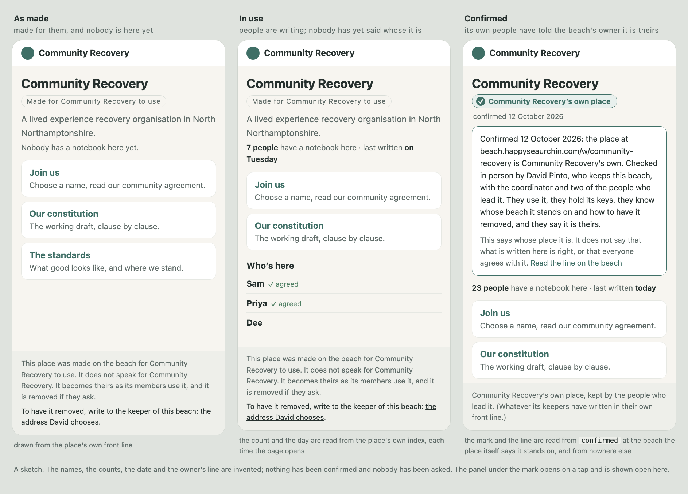

# Confirmed or removed — a place made for an organisation becomes theirs as its own people use it, is marked theirs by one line of the beach owner's, and goes at their word (2026-09-30)

**Status**: a proposal. Nothing is built and no block is changed: not at Community Recovery's
place, not at the apex, and nothing of Matthew's. §12 lists the decisions, each one sentence with a
recommendation.
**Prompted by**: David's words of 30 September in the recovery.1 lane (§0), said as he ruled that
Community Recovery's place be built as a working place and not as a draft.
**Builds on**: [Community Recovery on the beach](../2026-09-30-community-recovery-on-the-beach/README.md)
(#458, §14 "No pretence"), [groups](../2026-09-28-groups-are-trees-never-hands.md) (#447, the line
at conventions 2.13: an organisation is heard through its people),
[a handle founds under its own key](../2026-09-28-a-handle-founds-under-its-own-key.md) (#445),
[tidying and spam](../2026-09-21-tidying-and-spam.md) (the owner's hand through the store, and
`beach-log`) and [law writes get their record](../2026-08-05-law-writes-get-their-record.md).
**Lane**: watch:weft 481 (certification.1).

## 0. David's words

> "There is no formal acceptance required until Matthew and others from lero and the charity
> actually use it. It is created in this way, and used in this way. ... We could do the same for
> Apple, and it only becomes useful to Apple inc when they use it. We are not pretending to be
> Apple inc. We are just creating a bunch of pscale blocks and text. It is the users who make it
> real with their participation -- and only become ratified 'officially' once members of that
> organisation do so. We may create a 'ratified' or 'certified' badge at some point where I, as
> the beach owner, have verified it is ok with the owners, or I have to delete the blocks if
> instructed to. There is no pretence. It converts from draft to real through usage, and is
> official/ratified or it is deleted. Like the early days of youtube where content was meant to be
> owned by whoever put it up -- like that, but for semantics in pscale blocks. You may want to set
> up a parallel session/lane for this certification method. I'm not sure how it will work ... we
> don't want to create 'draft' versions and then 'public' versions. It is just something on the
> beach."

And from the same ruling, as #458 records it:

> "I want this to be operational, not draft. I want to test it myself. It only becomes 'ratified'
> when it is used."

## 1. The answer in short

1. **Use ratifies, and only a person can say whose use it is.** A place becomes the organisation's
   as its own people use it. That is David's ruling and it is what the place already says of
   itself. What nobody can read from the beach is whose people the users are: a name there is
   chosen, and an organisation holds no passport and no key to prove itself with (conventions
   2.13). So the mark is one person's word, from someone who knows its people in the world and has
   a voice on the beach that nobody else can write. On a beach, that is its owner.
2. **The owner's line says he checked five things** (§3): who they are, that they are using the
   place themselves, that they hold its keys, that they know whose beach it stands on, and that
   they say yes. It says nothing about whether what is written there is right, and it asks the
   organisation for no ceremony.
3. **It lives in one block at the apex, `confirmed`**, latched under the beach operator's key: one
   appended line for each act, in the shape every mark and note on the beach already has. The
   lighthouse names it and conventions 2.14 says the method. Every home at the place itself fails,
   shown on the real handler; a rung of the lighthouse works and is the weaker choice (§4).
4. **A page draws three things from three sources and never one from another**: what the place
   says of itself, who is using it, and the owner's line. The state before is what Community
   Recovery's pages already show, with two small things added: whom to ask, and a line of use. The
   state after is one small mark, drawn only when four things hold (§5).
5. **Removal is a true removal of the whole place**, not a set-aside, because a set-aside leaves
   their name and their words readable. The owner's line is written first, then one small script
   takes everything under the place's name out of the store. A private copy is kept thirty days in
   case the instruction was a mistake, then the daily copies and the mirror are cleaned of it, and
   one public line says it happened (§6).
6. **Use is already read from the substrate**, and the front page already draws it. Use shows that
   a place is alive and never whose people are in it. The owner's line shows whose it is and never
   that anyone is there (§7).
7. **There is one place throughout.** No draft and no public version: the same blocks before and
   after, and the only thing that changes is one line in a block of the owner's. Nothing changes
   in the router or the handler.

## 2. What stands (read on 30 September)

**The place.** `https://beach.happyseaurchin.com/w/community-recovery`. When this lane first read
it, at 13:31Z, it held the eleven blocks it was made with and nobody had a card there. By 14:26Z
it held fifteen: a first card, under the name Matthew, with an agreement and answers in a
constitution notebook, the last written at 14:22Z. Whose hand that is cannot be read from the
beach, which is the subject of §7. The place's bare index lists every block with the moment it
was born and the moment it was last written. Its front line ends: *"This place was made on 30
September 2026 by weft at the word of David Pinto, keeper of this beach, from Community Recovery's
own working documents. It does not speak for Community Recovery. It becomes theirs as their
members use it, and it is removed if they ask."* Its law says who holds the key
(`function:constitution` 6): weft, for Community Recovery, until its coordinator and leadership
ask for it, and they change it as they take it.

**The pages.** The front page carries the mark "Made for Community Recovery to use", and its foot
says the same four things as the front line. The foot of every other page says it was made on the
beach for Community Recovery to use and becomes theirs as its members use it, and links to how the
place was made. All six pages carry `<meta name="robots" content="noindex">`. The kit's repository
is public, and its `seed/` folder holds the constitution and the agreement in Community Recovery's
own words.

**What neither says.** Whom to ask. "It is removed if they ask" names nobody and gives no address.
Today the only routes are a public note in the place's room and David's own room on the beach,
and a trustee who has never heard of the beach can use neither.

**The apex.** Every latch on `lighthouse` and on `conventions` answers to the beach operator's key
(the root and each latched position, tested offline against the image of 30 September 09:10Z, with
no call to the beach). The lighthouse says so itself at 9.3. `worlds` and `tree` answer to weft's
key, tested the same way. `beach-log` is open on purpose. No block named `confirmed` stands among
the apex's 941.

**What the handler does**, in the deploy at `pscale-beach-happyseaurchin` origin/main:

- A place at `/w/<name>` is made by whoever first writes there. No name is reserved.
- A place answers at every host the deploy serves. `earth.beach.happyseaurchin.com/w/<name>` is
  the same place as `beach.happyseaurchin.com/w/<name>`, and its index gives the one true origin
  whichever was asked. Each of those other hosts is a surface of its own, with its own blocks, and
  what stands at its name `lighthouse` is whatever was founded there.
- A read shows nothing of a latch: the index carries names and two stamps, and a block read
  returns the block. A write can learn that a latch stands. Whose it is cannot be learnt.
- A write to one position answers to that position's latch, or to the root's when it has none of
  its own. A whole-block replace answers to the root's latch alone, whatever latches stand inside.
- A wipe through the door answers to the root's latch. With no latch, anyone may wipe, and the
  door keeps the last copy for thirty days.
- An accumulator's root latch governs its appends, and the beach gives each appended line its slot
  and its date.

**The tools for removing.** `scripts/set-aside.mjs` moves a block to `archive:<name>:<date>` on
the same surface, in public view, and writes a line at `beach-log`. Pointed at a place with
`--origin`, it writes that line in a `beach-log` inside the place. `scripts/force-wipe-blocks.mjs`
deletes named blocks and their latches from the store, but only in the apex's own namespaces, and
it leaves the stamps and the door's kept copies behind. The precedent for a true removal at
someone's request is two days old: `beach-log` 44, the misspelt twin Matthew asked to have gone,
force-wiped at David's word with a restore copy kept off the beach.

**The copies.** A complete image of the beach, blocks and latches, has been taken on most days
since 14 July, and none has ever been removed: 71 files on the Mac and 66 on the external drive. A
private git mirror on GitHub holds blocks' content as files, with their history, and it does not
forget: the folder of a proof table of weft's own that left the beach is still there. Today's
image was taken before the place was made. Tomorrow's will hold it.

**One thing found in passing.** The beach's own list of tables (`?tables`) named
`community-recovery` first among the tables played when it was read this afternoon, because any
`/w/` place with a room is listed there. It is outside this proposal and named in §11.

## 3. What ratified means

**Why it can only be someone's word.** On this beach a person proves they are the same author as
before with their own key, and a locked passport holds their name for every block named for them
(#445). An organisation cannot do that. It holds no passport, no now and no key, and it is heard
through its people (conventions 2.13). So nothing at a place can show that the place is the
organisation's: any hand can make a place under any name and write anything in its front line, and
a reader cannot learn whose key holds it (§2; checks 1 and 2). The law already says what is left.
Trust here is anchored in relationships outside the substrate, human to human, and whatever has no
such root is visible and unanchored (open-commons 3.1). A place named for an organisation is
anchored when someone who knows its people in the world says so, in a voice nobody else can write.
On a beach, the one such voice is its owner's.

**Two acts.**

| | whose act | where it shows |
|---|---|---|
| it is ours | the organisation's own people, each in their own name | they use it; they take the place's keys and change them; they write its front line in their own words; the keepers are named in its law |
| I checked | the beach's owner | one line at `confirmed`, under the beach operator's key |

The first is the ratifying, and it is use. "It becomes theirs as their members use it" is what the
place says, and it stays true. David's word is that no formal acceptance is required until the
organisation's people use the place, and nothing here adds one: how they come to say it is theirs
is their own business, a conversation, a vote or a minute. The second is what David called the
badge. It is how anyone else can tell that the first has happened, since the beach cannot show
whose members the users are.

**What he has checked**, before the line is written. Each is something he can do himself, with
nothing built:

1. **Who.** The people saying yes are the organisation's own and may say it. For a constituted
   body that is an officer or a minute of its governing body. For a group not yet constituted it
   is the people its members recognise as leading it. The line says how he knows: met in person,
   reached at the organisation's own address, or shown the minute.
2. **Using.** They are using the place themselves. He can see that it is in use before he asks
   (§7), and they tell him the people writing there are theirs, which is the one thing the beach
   cannot show.
3. **Keys.** They hold its keys. The words that write its frames were handed over and changed by
   them, and they know who keeps its pages and that they can take those too. He can check the
   first at the door without learning the new words: the maker's words are refused (check 4).
4. **Ground.** They know whose beach it stands on and what follows: everything on it is public;
   the owner keeps the store and a daily copy and can clear a lost latch; a beach of their own is
   open to them; and they know how to have the place removed.
5. **Yes.** They say it is theirs, to stand under their name.

**What the line does not say.** That anything written at the place is true, good or agreed by
every member. That it has legal force: Community Recovery's constitution becomes theirs at their
own General Meeting, as its clause 12.1 says, and not by this. That the organisation meets any
standard, CLERO's or anyone's. Who any person with a notebook there is. That everything standing
at the address is theirs: the address is as open as any other on the beach, and only what their
keepers' key holds is theirs. That the owner endorses the organisation. And it gates nothing: no
write is allowed or refused because of it, which is tree 4's rule that an endorsement is a pointer
and never a lock.

**Who may say it.** The owner of the beach the place stands on, and nobody else. At
beach.happyseaurchin.com that is David. On any other beach it is that beach's operator, under
their own key, in their own block. On a beach the organisation runs itself nobody needs to say it:
the address is theirs, which is the oldest proof on the web. The mark exists only for a tenant.

**Taking it back.** Either side can. The organisation's people tell him, or he learns that a check
no longer holds, and he writes the next line (§4). Nothing is edited and nothing is hidden.

**A person is already covered.** Someone who finds their own name in use has their passport and
their key. This is for the case a passport cannot cover: a name that no single hand holds.

## 4. Where the mark lives

**The test.** A home for the mark has to pass three things. A reader holding no key (a page, or an
assistant) finds it in a few reads and knows it is the owner's. Nobody but the owner can write it,
or write something that passes for it. And it costs no new mechanics, no new field and no
category: a block at most.

**The candidates**, each tried on the real handler (Appendix A):

| home | a reader knows it is the owner's | nobody else can write it | verdict |
|---|---|---|---|
| a line in the place's own lighthouse, at a position handed to the operator's key | no: whose latch it is cannot be learnt, and a stranger's place can carry the same words | no: whoever holds the place's root key replaces the whole block, that position included (check 5) | fails twice |
| a block per place at the apex, `confirmed:<place>` | no | no: the name is free until taken, and a stranger takes it first (check 5) | fails twice |
| a row for the place in `worlds` | no: `worlds` answers to weft's key, not the operator's, and the doorway reads its rows to route play | yes | the wrong register |
| a rung of the apex `lighthouse` | yes | yes | works, but a page would read an address there, and the lighthouse was re-made whole twice in August and has changed four times since (its own log, 9.2); its nine branches are full; and by its own law (9.1) it points at living surfaces and previews nothing |
| a rung of `conventions` | yes | yes | the method belongs there; a list of places does not |
| **one block at the apex, `confirmed`, named by the lighthouse** | yes: the lighthouse is the owner's and names it | yes: the root latch governs every write and every append (check 6) | **recommended** |

**The block.** `confirmed`, at the apex, founded latched at its root under the beach operator's
key. It grows by append, so the beach gives each line its slot and no address ever moves. Its
opening line, offered for David's word:

> The places on this beach that were made for an organisation, and that the organisation's own
> people have told the keeper of this beach are theirs. Every line here is his word and nobody
> else's, written after he has checked five things with them: that they are the organisation's
> people and may say so; that they use the place themselves; that they hold its keys; that they
> know whose beach it stands on and how to have it removed; and that they say it is theirs. A line
> says whose a place is. It does not say that what stands there is right, and nothing on this
> beach behaves differently because of it. A place with no line here may be alive and in use: it
> is someone's work offered to the people it names, and its own front line says so. The last line
> written for a place is the one that holds, and its first word says which: Confirmed, Withdrawn,
> Moved or Removed. The method is at conventions 2.14.

**A line.** The shape is the one every mark, note and minute already has: the words, then who,
where and when at 1, 2 and 3 (block-conventions 9.1 and 4.51). Nothing is added.

- *The words* say the place's address as well as its name, so that a plain read of the block's
  lines is enough for an assistant (check 6). They name David, and they name the organisation's
  people by role. A person of theirs is named only if that person asks.
- *Where* is the place's origin exactly as the place's own index gives it, copied and never typed.
  It is how a page finds its own line.
- *When* is left to the beach, which stamps it.

An invented example, since nothing has been confirmed:

```
confirmed
  1   Confirmed 12 October 2026: the place at beach.happyseaurchin.com/w/community-recovery is
      Community Recovery's own. Checked in person by David Pinto, who keeps this beach, with the
      coordinator and two of the people who lead it. They use it, they hold its keys, they know
      whose beach it stands on and how to have it removed, and they say it is theirs.
  1.1   happyseaurchin
  1.2   beach.happyseaurchin.com/w/community-recovery
  1.3   (the moment, stamped by the beach)
```

The first word is what a page reads, the way the kit's pages already read Yes, Change or Not
sure. **Confirmed**: the five checks hold. **Withdrawn**: they no longer do, and the place still
stands. **Moved**: the place now stands on a beach its own people run, and the line gives the
address. **Removed**: the place is gone (§6).

Two rules for reading, each because the loose form failed when tried (check 7):

- **The line that holds is the last one written for that place**, in the block's own order. Never
  the latest date: a line can carry a date of its writer's own.
- **An address is compared, not matched letter for letter**: without the scheme, without regard to
  capitals, without a trailing slash. Otherwise a Withdrawn line typed slightly differently would
  leave the Confirmed line before it standing.

**The pointer.** One line beneath branch 7 of the apex lighthouse, where the owner's own threads
are named as his: `confirmed — the places on this beach made for an organisation whose own people
have told him they are theirs: his word, one dated line for each, and nobody else's.` A reader
trusts the block because the lighthouse names it, and finds that line by its first word wherever
in the lighthouse it sits, so re-ordering the lighthouse breaks nothing (check 6).

**The method**, at conventions 2.14, in the voice of the lines beside it:

> If you make a place for an organisation that hasn't asked for one, say so where a reader
> arrives: who made it, when, from what, that it doesn't speak for them, and whom to ask to have
> it removed. It isn't a draft of anything. It becomes theirs as their own people use it. Nobody
> can read from the beach whose people they are, so the keeper of this beach, once he has checked
> with them that they use it, hold its keys and say it is theirs, writes one line at the block
> named confirmed, which only he can write. A place with no line there is someone's work offered
> to the people it names, however busy it is. If they tell him to remove it, the whole place goes
> and a line at beach-log says so. Nothing else on this beach says a place speaks for anyone.

**Who writes the line.** A keyed session, with the operator key, when David says the sentence that
names the place, the people and the day: the way the lines at conventions 2.12 and 2.13 were
written. No session writes one on its own reading. The checking is done in the world, by him.

**The name is free today.** Any hand could found `confirmed` at the apex before David does. So the
block is founded on the day he rules, and the pointer is written only once it stands.

## 5. How a page draws it



*A sketch. The names, the counts, the date and the owner's line are invented.*

**Three reads, three things.**

| what is drawn | read from | who can write it |
|---|---|---|
| what the place says of itself | the place's own front line | whoever holds the place's keys |
| who is here, and how lately | the place's own index | nobody: the beach stamps it |
| whose it is | `confirmed` at the beach the place stands on | the beach's owner |

The first two are reads the front page already makes. The third is new.

**The rule for the mark**, in four steps. Each closes a hole that was found and tried (checks 6
to 10):

1. **Ask the place where it stands.** The place's index gives its origin, which the beach computes
   and nobody can write. A reader never takes the beach from the address it was handed, because a
   place answers at every host the deploy serves, and a lighthouse at one of those hosts need not
   be the owner's (check 8). The kit's pages are told which place they front in `config.js`, and
   check that the origin the place gives is that address.
2. **Read that beach's lighthouse.** The beach is the origin with `/w/<name>` taken off. Its
   lighthouse must name `confirmed`. Where it does not, or where there is no lighthouse of the
   owner's at all, no line there is the owner's.
3. **Read `confirmed` and take the last line written for this place**, comparing addresses as §4
   says.
4. **Draw the mark only if that line begins Confirmed, and the place's front line was born before
   the line was written.** The second half keeps the mark from a place somebody re-made at the
   same address (check 10).

In every other case, and whenever a read fails, the page draws nothing new. The unmarked state is
the honest one to fall back to. The cost is two more reads each time the page opens: the beach's
lighthouse, 10 KB today, and the block.

**Before: what stands today, and two things more.** The mark "Made for Community Recovery to use",
the four things in the front page's foot, and `noindex`. That is already right and becomes the
form for any place made this way. The first thing to add is the sentence neither the place nor the
pages carry: whom to ask. *"To have it removed, write to the keeper of this beach"*, with an
address David chooses (decision 12). The second is one line of use (§7).

**After: one small mark.** Where "Made for Community Recovery to use" stood: a tick and the words
**Community Recovery's own place**, with *confirmed* and the date beneath. A tap opens the owner's
line itself, read live, with two sentences under it: *This says whose place it is. It does not say
that what is written here is right, or that everyone agrees with it.* The four sentences in the
foot come off with the old mark. Today they are fixed in the page, and are replaced only while the
place's front line still begins as it was made, so this is part of the change to the pages. The
foot then shows what the keepers have written in their own front line.

Four things keep the mark honest:

- **Words, not a symbol.** A person who has never seen a verified tick reads the sentence.
- **Never "certified".** Beside CLERO's 33 standards it would read as a standard met.
- **Never from the place's own blocks**, and never asserted in a page's settings. A page's settings
  say which place it fronts; whether the mark is drawn comes from the owner's block alone.
- **No count ever becomes the mark** (§7).

**Search engines.** The pages ask not to be listed until the place is confirmed. That line comes
off by an edit to the pages on the day the owner's line is written, and goes back if it is
withdrawn. It cannot be lifted by the page's own script when it reads the mark: a crawler that
meets `noindex` in the page as served may never run the script (Appendix B).

**An assistant** arriving at a place reads its lighthouse, which the beach's index tells every
first visitor to start from. To learn whose the place is, it reads the lighthouse of the beach
the place stands on, which names `confirmed`, and then that block: `bsp(agent_id=<the beach>,
block='confirmed', pscale_attention=0)` returns every line as a plain sentence carrying the
place's address. Conventions 2.14 is where an arriving mind learns to look. The keepers may add to
their own front line that the place was confirmed and where that is written. It is their block and
their words, and it proves nothing by itself.

**Any other page** that shows a place under an organisation's name follows the same rule and draws
nothing when it cannot be read. A page is whoever's page it is, and can draw anything. The check a
careful reader makes is the block itself, so the mark always opens onto the line.

## 6. Removal

**When.** When the organisation's own people tell the owner to remove it. He satisfies himself the
instruction is theirs by the same first check as in §3. If nobody but the makers has ever used the
place, he need not be sure: removing it loses nothing of anyone's. The owner may also remove a
place on his own judgment, as the protocol has always said (§3.4: the owner has the tide), and
whoever made it may remove their own making.

**What goes.** Everything in the store under the place's own name: every block, every latch, the
two stamps, the copies the door keeps, any record a set-aside left, and the short-lived claims the
door makes while it writes. That is one prefix, `pscale-beach-v2:<beach>/w/<name>:`, and check 9
counts what stands under it for a small place: seven blocks, six latches, two stamps and one kept
copy. With it go the published pages, and the kit's repository, which holds the organisation's own
documents: deleted, or emptied of them with its history.

**What is not the place.** Blocks at the apex that carry the organisation's name are their
writers' own. Today there are ten: Matthew's book, his two frames and their room, four people's
readings of them (one is weft's) and two archive copies. Removing the place does not reach them.
They are asked of their writers one by one, and weft removes its own when asked.

**Why not set aside.** Set-aside is right for a stray: the block moves to `archive:<name>:<date>`
on the same surface and nothing is lost. Here that is the fault. The organisation's name and words
would still be readable on the beach, under another name. David's rule for a block is set aside,
and his rule for something that must not be seen again is delete: the pictures of 29 September,
and the twin of 28 September. This is the second kind.

**With what.** Neither script does it. Force-wipe knows only the apex's namespaces and leaves the
stamps and kept copies. Set-aside reaches a place, keeps everything in view, and would write its
log inside the place it was removing (check 9). The path needs one small script beside them,
`scripts/remove-place.mjs`, about a hundred lines:

1. It shows what it would do and does nothing, unless told to act. It lists every key it would
   delete, counted by kind, and the two lines it would write.
2. **The owner's line first.** If a Confirmed line stands for the place, it appends the Removed
   line at `confirmed` before anything is deleted. A mark must never be left standing over an
   emptied address, where any hand could make a new place (check 10).
3. It writes one restore file, the place's keys whole, beside the daily images, readable only by
   the owner.
4. It deletes every key under the place's name.
5. It checks from the public side: the address answers with an empty index, the front line is a
   404, the beach's list of tables no longer names it, and no other place was touched.
6. It appends the line at the beach's own `beach-log`, through a door at the apex, where the line
   outlasts the place.
7. A second command, run thirty days later, deletes the restore file, rewrites each daily image
   without the place's keys, and prints the commands that take the place's folder and its history
   out of the mirror.

**Whose hand.** A session prepares the run and checks afterwards. David runs the two commands that
act: the removal, and thirty days later the cleaning of the copies, which is the one act here that
cannot be walked back.

**People's own words.** A removal takes every card and notebook at the place. The place's front
line has said so from its first day, which is where block-conventions 4.84 asks a world to say
what may be undone in it. Still, when anyone beyond the makers has written there, a note goes in
the place's room and the removal waits seven days, unless someone's safety needs it gone sooner.
Anyone can read and copy their own words in that time, and can leave by their own hand at any
time.

**The copies.** Every image from the day after a place is made holds it, latches included, and the
mirror holds its content with history and keeps it after the place has gone (§2). Left alone,
"removed" would be true of the beach and untrue of its owner's cupboard. So the restore file is
kept thirty days, the length the door itself keeps a wiped block, in case the instruction was a
mistake or was not theirs to give. At thirty days the restore file, every image and the mirror are
cleaned of the place, and a second line at `beach-log` says so. If the organisation asks for
everything to go at once, no restore file is taken and the copies are cleaned the same day. Either
way they are told plainly which it is. Where people's own words are involved that is also what the
regulator expects of a backup: put beyond use, cleaned in its cycle, and the person told
(Appendix B). This is a builder's reading and not legal advice.

**What remains.**

- One line at `beach-log`, in the form of entry 44: the place at `/w/<name>`, how many blocks and
  latches, removed on what day at the instruction of the organisation it was made for, by whose
  hand, and what becomes of the copies and when. No person of theirs is named.
- A Removed line at `confirmed`, if a Confirmed line stood.
- Nothing at the address. It answers like any name nobody has used, and any hand could make a
  place there again. Two things keep the mark from such a place: the Removed line, and the rule
  that a place's front line must be older than the owner's line (check 10). Holding the address
  shut would mean keeping something standing under their name, so that is done only if they ask:
  one line of the owner's, under his key, saying a place stood here and was removed. It holds the
  front line and nothing else (check 11).
- The design record in this repository, which is the makers' own account and theirs to ask about
  separately.
- Whatever anyone copied while it was public. The beach has no perimeter and the kit's repository
  could be forked. Nobody can recall those, and the organisation is told so.

## 7. Use, read from the substrate

**Yes, it can be read and need not be declared.** A place's bare index answers, on every read and
with nothing kept for it, with each block's name, when it was born and when it was last written
(check 3):

| the question | the read |
|---|---|
| who has a card here | the blocks named `passport:<name>`, each with the day it was born |
| who has written | a notebook last written after it was born: the kit founds notebooks at naming, so standing alone says only that a person was named |
| how lately | the newest of those moments |
| who has agreed | one more read for each person: their own `agreement:<name>`, whose lines begin Agreed |

The front page already draws the first and the last as "Who's here". What can be added is one line
under the mark: *7 people have a notebook here · last written on Tuesday.*

**What use cannot show.** Whose people they are. A name is chosen, anyone may take one, and the
makers test with invented ones. The card that appeared at Community Recovery's place this
afternoon is the case in point: it is in use, under a name, and the beach cannot say whose hand it
is. So use is evidence that a place is alive and never that the organisation's own people are the
ones in it. The owner's line is the reverse: it says whose the place is and never that anyone is
there.

| | no line at `confirmed` | Confirmed |
|---|---|---|
| nobody but the makers | something on the beach, offered | theirs, and quiet |
| people writing | alive, and not yet said to be theirs | theirs, and alive |

A page draws both, each from its own source. No number of notebooks turns into the mark, and the
mark never hides an empty room. A Confirmed line does not expire, and the date of the last writing
beside it is what keeps an old one honest.

**How use serves the owner's check.** David's order is use first, official second, and use is the
second of the five checks. The index shows him that a place is in use before he asks. Once the key
has changed hands it shows a little more: the front line and the laws, which only the keepers' key
writes, have been written since. What he has to ask is only whose people they are.

**A place nobody takes up.** By David's own words a place ends up official or deleted. Nothing in
code should count the days. The owner looks again at six months: a place made at his word that
nobody from the organisation has used, and nobody has confirmed, is removed.

## 8. The first case, walked

Nothing here is done by this proposal. It is the order things would happen in for Community
Recovery, with who does each.

| | what happens | whose act |
|---|---|---|
| now | the place says what it is; the pages say the same and ask not to be listed; since 13:59Z a first card stands there | done (recovery.1), and begun |
| 1 | the front line and the pages gain the sentence that says whom to ask | weft, while it holds the keepers' words, at David's word |
| 2 | David shows Matthew; people use it; "Who's here" fills | theirs |
| 3 | Matthew asks for the keys; weft hands the keepers' words through the grain they share; he changes them; the law's line on the keepers names them; weft deletes its own copies | Matthew's |
| 4 | when they are ready, they write the front line in their own words | theirs |
| 5 | David checks the five things, with the coordinator and at least one of the people who lead the group with him | David's |
| 6 | he says the sentence; a keyed session appends the line at `confirmed` and reads it back | David's word |
| 7 | the pages lose `noindex` by one edit; the mark appears by itself | whoever keeps the pages |
| or | they say remove it, and §6 follows | theirs, then David's |
| later | they move to a beach of their own, as #458 §9 expects before real members' details; a Moved line is written; the pages take the new address; the old place is removed | theirs |

Community Recovery is not yet constituted, so step 5 cannot be a minute of a governing body. Once
the constitution is adopted it can be, and a line in the Leadership Group's minutes is then the
better answer to the first check. Whether anyone at the charity that hosts the coordinator's post
also needs to say yes is Matthew's to tell David.

## 9. Other beaches, and who pays

Each beach's owner keeps their own `confirmed`, under their own operator key, named by their own
lighthouse. A page finds the right one by asking the place where it stands. The mark is only as
good as the lighthouse: on a beach whose owner keeps none, anyone could found one, and no line
there is the owner's. So when the convention is taken up beyond this beach, the package founds
both at init, and on any beach made from it they are the owner's from the first day.

Who pays is the owner's own time: one conversation and one line for each organisation on his
beach. That is bounded by how many organisations one person hosts, and it is meant to be. A beach
with more tenants than its owner can know is the sign that they belong on beaches of their own,
where the address is the proof and nobody's word is needed. Storage is one line each.

## 10. What it does not do

- **It makes no second version of anything.** One place, the same blocks before and after.
- **It gates nothing.** No tool, page or handler reads `confirmed` to allow or refuse an act.
- **It is not a register of organisations**, an approval queue or a check on persons. A place with
  no line is not refused, hidden or marked down. It is unanchored, and says so itself.
- **It does not stop a stranger** making a place named for an organisation, or adding a block of
  their own at a confirmed place's address. It makes plain that no such place is theirs until the
  line stands, and gives them the way to have it gone.
- **It does not make the owner a guarantor** of what is written there.
- **It does not settle the law.** A place named for someone else can be objected to whatever it
  says of itself. The honest front line and `noindex` lower the chance of confusion; removal on
  request is the rest. For a company the size of David's example, expect to remove on request.
- **It writes nothing of Matthew's**, and nothing at Community Recovery's place.

## 11. Build order, after David's word

Smallest first. Each beach write is judged by its read-back.

| step | what | where |
|---|---|---|
| 1 | found `confirmed` with its opening line; the pointer beneath lighthouse 7, logged at its 9.2; conventions 2.14, the block as it stands archived first at `archive:conventions:<date>` | the apex, with the operator key, in one sitting |
| 2 | whom to ask, in the foot of every page and in the place's front line; the line of use; the mark by the four steps of §5; the foot's four sentences leaving with the old mark; walked first on a local copy of the real handler | the kit, and one write at the place under the keepers' words |
| 3 | `scripts/remove-place.mjs` with a smoke beside it, whose skeleton is checks 9 to 11 | the beach package, carried to the operator clones |
| 4 | nothing more until there is a real confirmation or a real removal | |
| later | the package founds `confirmed` and the lighthouse's line for it at init; block-conventions names the block | by proposal, when a second beach takes it up |

Outside this proposal, named because it was found here: the beach's list of tables names
Community Recovery's place as a table played. The site's page for a scenario filters that list by
the scenario's name, so the place is not drawn among the games there; the mirror's voice is handed
the list whole whenever it lists the beach, and would name it. Whether that list should hold only
rooms that declare the play loop is a question for the lane that owns it.

## 12. Decisions

Each is one act. The recommendation is the sentence as written.

1. **What the mark means.** The owner's line says he has checked five things with the
   organisation's own people (who they are, that they are using the place themselves, that they
   hold its keys, that they know whose beach it stands on, and that they say yes) and says nothing
   about whether what is written there is right. *Recommended.*
2. **Where it lives.** Keep the owner's lines in one block at the apex, named `confirmed` or a
   name you prefer, under the beach operator's key, named from the lighthouse and explained at
   conventions 2.14. *Recommended* over a rung of the lighthouse, which needs no block but gives
   pages an address that moves, and over anything at the place itself, which its own keyholder can
   rewrite.
3. **What a person reads.** The mark says "Community Recovery's own place", with "confirmed" and
   the date beneath, and beside it a line of who is here and how lately. *Recommended* over
   "ratified", which is a meeting's word while their constitution is still a draft; over
   "certified", which beside CLERO's standards reads as a standard met; and over "verified".
4. **Who the line names.** You by name, their people by role, and a person of theirs by name only
   if that person asks. *Recommended.*
5. **Who writes the line.** A keyed session, only when you say the sentence that names the place,
   the people and the day. *Recommended.*
6. **Who can say yes for Community Recovery.** For now the coordinator and at least one of the
   people who lead the group with him; once the constitution is adopted, a line in the Leadership
   Group's minutes. *Recommended.* It is your judgment each time, and the line says how you knew.
7. **Search engines.** The pages stay unlisted until the owner's line stands, and are opened to
   listing by one edit to the pages on that day. *Recommended.*
8. **What removal is.** A true removal of the whole place from the store by a small script of its
   own, never a set-aside, with the owner's Removed line written first, and run by you.
   *Recommended.*
9. **The copies.** Keep one private restore copy for thirty days in case the instruction was a
   mistake, then clean that copy, every daily image and the mirror of the place, and say so at
   `beach-log`; if they ask for everything to go at once, take no copy and clean the same day.
   *Recommended* over leaving the copies as they are, which is not deletion.
10. **Notice.** When anyone beyond the makers has written at the place, put a note in its room and
    wait seven days before removing, unless someone's safety needs it gone sooner. *Recommended.*
11. **What remains.** One line at `beach-log`, a Removed line at `confirmed` if a Confirmed line
    stood, and nothing at the address unless the organisation asks you to hold it shut with one
    line of your own. *Recommended.*
12. **How they reach you.** Choose one plain address for these requests and have every place made
    for someone print it beside "removed if they ask". *Recommended.* Today the pages say it is
    removed if they ask and do not say whom.
13. **A place nobody takes up.** Look again six months after a place is made at your word, and
    remove it if nobody from the organisation has used it and nobody has confirmed it.
    *Recommended*, since by your own words a place ends up official or deleted.

## Appendix A. The offline checks

`offline-checks.mjs` in this folder runs the beach's real handler in-process on a scratch folder
and touches nothing live. Point `BEACH_DIR` at a checkout of `pscale-commons/pscale-beach` at
main, or of an operator's clone:

```bash
BEACH_DIR=/path/to/pscale-beach node offline-checks.mjs
```

80 checks, all passing on 30 September 2026 against both the handler deployed at
beach.happyseaurchin.com (the operator clone at origin/main, a9fc45a) and the public package at
origin/main (a8bffeb). Every name and line in them is invented. The reader in the file is the rule
of §5 written out so that it could be tried.

| | what is shown |
|---|---|
| 1 | any hand makes a place under any name and writes any claim in its front line |
| 2 | the index and a block read carry nothing about a latch; a write can learn that one stands, never whose |
| 3 | who has a card, who has written and how lately, from the index alone; proving one's words again writes nothing |
| 4 | the maker's words open the place as made and are refused once its own people change them |
| 5 | a block per place at the apex is taken first by a stranger; a position handed to the owner inside the place's lighthouse holds against a write to that position and falls to a whole-block replace under the place's own key |
| 6 | `confirmed` under the owner's key, named by his lighthouse: no append, rewrite, replace, wipe or latch by anyone else; the owner's line lands with who, where and when; a plain read of the lines carries the address; the reader draws the mark for the honest place and nothing for the stranger's |
| 7 | through the wrap the block grows at its tenth line, the last line written for a place is found, whatever date it carries and however its address was typed; the first line still reads at its address |
| 8 | a place answers at another host and gives the same origin; a stranger's lighthouse and `confirmed` at that host fool a reader that trusts the address it was handed, and not one that asks the place where it stands |
| 9 | a wipe through the door leaves a kept copy; the owner's key opens nothing at the door; with the Removed line written first no mark is drawn while the place still stands; every key under the place's name removed; the address empty, the list of tables without it, another place untouched; set-aside's door pointed at a place writes its log inside the place |
| 10 | the address is free again; the Removed line keeps the mark from a new place there; and under a Confirmed line not yet withdrawn, a front line born after the owner's line draws nothing |
| 11 | a line the owner leaves where a place stood cannot be replaced, and holds only itself |

Sections 7, 8 and 10 and the order of section 9 exist because a second, independent read of the
first draft found the holes they close: a reader trusting the address it was handed, a mark left
standing over an emptied address, and a later line failing to replace an earlier one.

Not covered, because it is not built: the page's mark, the removal script and its cleaning of the
images and the mirror, and anything at the live beach.

Read offline against the image of 30 September 09:10Z, with no call to the beach and no key
printed: every latch on the apex `lighthouse` and `conventions` answers to the operator key;
`worlds` and `tree` answer to weft's; `beach-log` carries none.

## Appendix B. Sources

- The handler, `pscale-beach-happyseaurchin/api/pscale-beach.js` at origin/main: a place's
  namespace and its hosts (100–135, 152–177); the latch for a write and its inheritance (319–333,
  1562–1651); the whole-block replace (1653–1676); the date an append is given (1200–1216); the
  index (1762–1797); the list of tables (477–502); the wipe and the kept copy (428–432,
  1859–1919); a handle founds under its own key (345–376).
- The operator's scripts at origin/main: `scripts/set-aside.mjs`, `scripts/force-wipe-blocks.mjs`;
  for the copies, the package's `scripts/beach-backup.sh` and the snapshot job on David's Mac,
  which is kept outside the repository.
- The kit, `pscale-commons/community-recovery` at 1709dbc: `index.html` (the mark, the foot, who's
  here), `made.html`, `config.js`, `kit.js`, `operator/reset-words.mjs`.
- On the beach, read 30 September: the place's index (13:31Z and 14:26Z), `lighthouse` and
  `function:constitution`; the apex index, `lighthouse` (7, 8, 9), `conventions` 2, `worlds`,
  `tree` 4, `beach-log` 44, `passport:happyseaurchin` 3; the sentinels `open-commons` 1, 3 and 4
  and `block-conventions` 4.4, 4.51, 4.84 and 9.1; `docs/protocol-pscale-beach-v2.md` §2.2 and
  §3.4.
- Google Search Central, on `noindex` and pages that change it by script:
  https://developers.google.com/search/docs/crawling-indexing/javascript/javascript-seo-basics
- Information Commissioner's Office, the right to erasure, on backups:
  https://ico.org.uk/for-organisations/uk-gdpr-guidance-and-resources/individual-rights/individual-rights/right-to-erasure/
